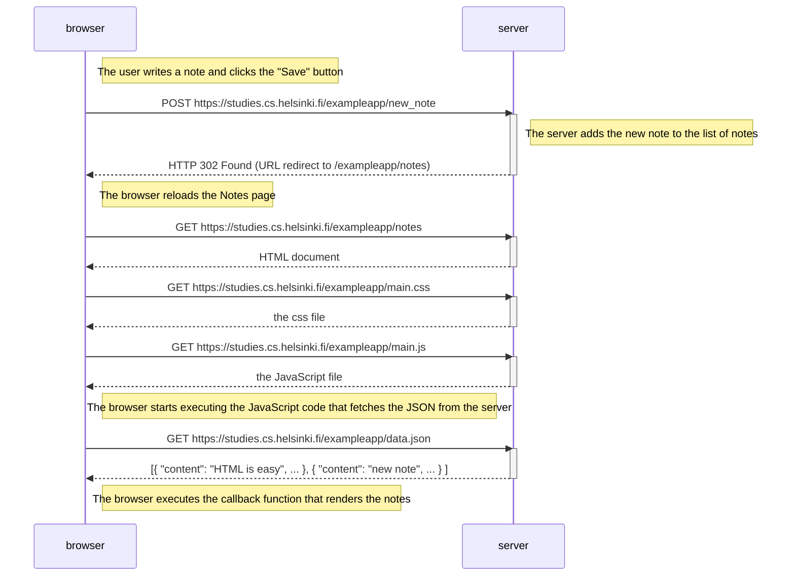

```mermaid
sequenceDiagram
    participant browser
    participant server

    Note right of browser: The user writes a note and clicks the "Save" button

    browser->>server: POST https://studies.cs.helsinki.fi/exampleapp/new_note
    activate server
    Note right of server: The server adds the new note to the list of notes
    server-->>browser: HTTP 302 Found (URL redirect to /exampleapp/notes)
    deactivate server

    Note right of browser: The browser reloads the Notes page

    browser->>server: GET https://studies.cs.helsinki.fi/exampleapp/notes
    activate server
    server-->>browser: HTML document
    deactivate server

    browser->>server: GET https://studies.cs.helsinki.fi/exampleapp/main.css
    activate server
    server-->>browser: the css file
    deactivate server

    browser->>server: GET https://studies.cs.helsinki.fi/exampleapp/main.js
    activate server
    server-->>browser: the JavaScript file
    deactivate server

    Note right of browser: The browser starts executing the JavaScript code that fetches the JSON from the server

    browser->>server: GET https://studies.cs.helsinki.fi/exampleapp/data.json
    activate server
    server-->>browser: [{ "content": "HTML is easy", ... }, { "content": "new note", ... } ]
    deactivate server

    Note right of browser: The browser executes the callback function that renders the notes
```