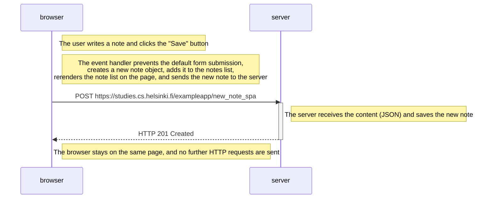

```mermaid
sequenceDiagram
    participant browser
    participant server

    Note right of browser: The user writes a note and clicks the "Save" button

    Note right of browser: The event handler prevents the default form submission,<br/>creates a new note object, adds it to the notes list,<br/>rerenders the note list on the page, and sends the new note to the server

    browser->>server: POST https://studies.cs.helsinki.fi/exampleapp/new_note_spa   
    activate server
    Note right of server: The server receives the content (JSON) and saves the new note
    server-->>browser: HTTP 201 Created
    deactivate server

    Note right of browser: The browser stays on the same page, and no further HTTP requests are sent
```